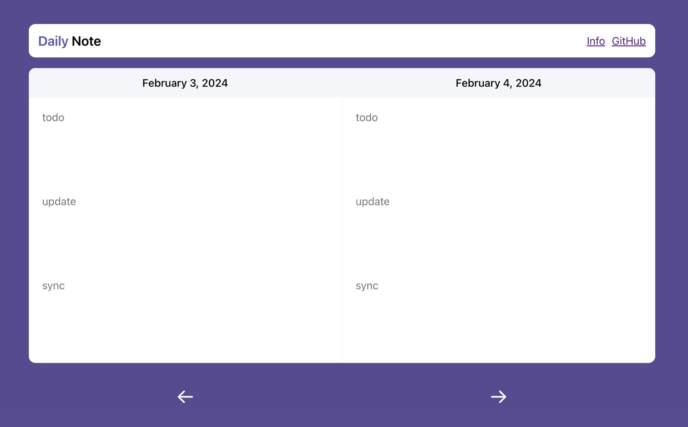

# Daily Note
<p align="center">
  
</p>

Daily Note is an web application that you can use to take notes for daily meetings. It works offline and keep storage at your browser.

## Motivation

The daily meetings are important to keep the team updated and aligned. You can take small notes to remember what are you going to say in the next meeting. The app solves it with 3 field:

- **Todo**: What are you planning to do
- **Update**: What have you completed
- **Sync**: Should you talk with other team members about something, or block something

## Features

Here are the amazing features of the app:

- **Offline**: The app works offline
- **Storage**: Stores the data at local storage
- **Simple**: Just 3 fields to fill
- **Auto Save**: The app saves the data automatically
- **Responsive**: Works on mobile and desktop
- **Theme**: Dark and Light themes

## Development

You can run the app with the following commands:
```bash
// clone the repo
pnpm install
pnpm dev
```

## License

MIT